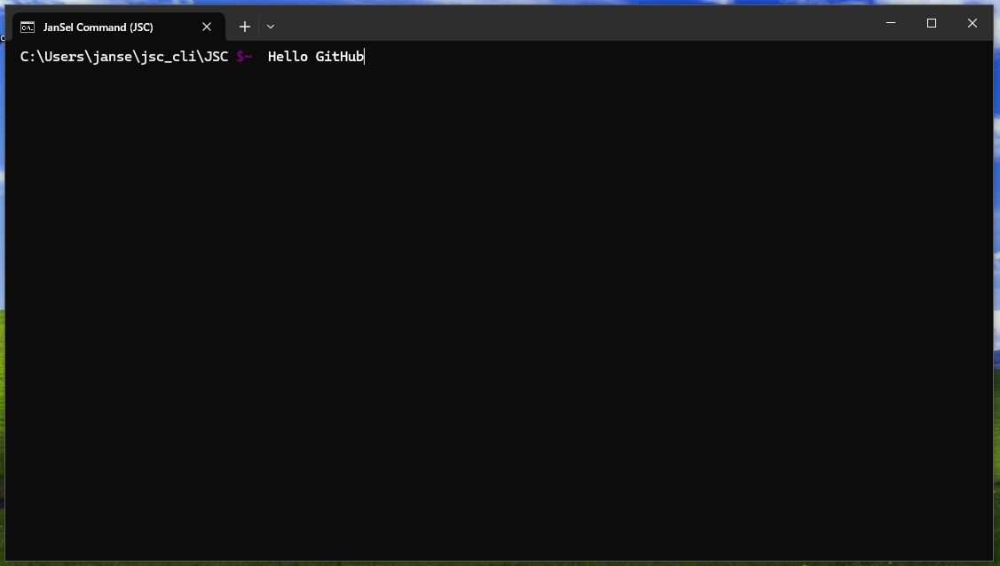

# JSC Pre-Release Beta Alpha v1.1.2 : 46 Commands (PBA1.1.2:46)

JSC is still in development, but you can install the Alpha version! Install it at http://jansel.pages.dev or on GitHub (listed on the website or just go to http://github.com/jansel1/jsc_cli)

(The version listed above is the current version - I might forget to update the version on the website)

This is a fully open-source project, feel free to send pull request!

**I highly suggest using Windows Terminal, so please, INSTALL IT AND SET IT AS THE DEFAULT!**
(tutorial on how to install it)
**P.S the website isn't regularly maintained - it's prone to bugs. I wont be updating it for a while.**
# What is JSC?
P.S the website isn't regularly maintained - it's prone to bugs. I wont be updating it for a while.

JSC is a open-source Python CLI that helps with important tasks.
Most commands I made are kinda random, but there sure is a ton.

(taken on PBA 1.1.2:46)

Thanks for installing!

# Read the docs!
[Documentation](./DOC.md)

[Install Windows Terminal (Recommended)](./TERMINAL.md)

# More
This is made using Python, and with that, sadly, the EXE size will be huge.
I didn't make this in any other language due to complexity, which is crucial here. I made this in Python so writing commands would be easier, but that carries the Risk of it being slow and big. 

However, from here on out, I won't release anymore standalone versions!

Also, PBA stands for "Prerelease Beta Alpha", aka should not be used lol.
Also, I won't bother to update the release page on the github for a while.

# DISCLAIMER!
Most Windows devices will flag all of our binary releases as viruses! This is due to the PyInstaller/AutoPyToExe executable not being signed. Please do not worry, and if you still don't trust it, feel free to recompile it using PyInstaller/AutoPyToExe!

# Debugging

If you can't install JSC through the website, here are some ways to fix this:

    * Re-open your browser
    * Refresh page
    * Install it from GitHub (github.com/jansel1/jsc_cli/)

JSC not working/crashing
If ran using Python, make sure all libraries are installed (to install them, use our Library Installer on the release page or manually install them.

Make sure you are using Windows 10, with ~25mb of free disk space.

Let us know if it still wont work, 8/10 this is our issue.
