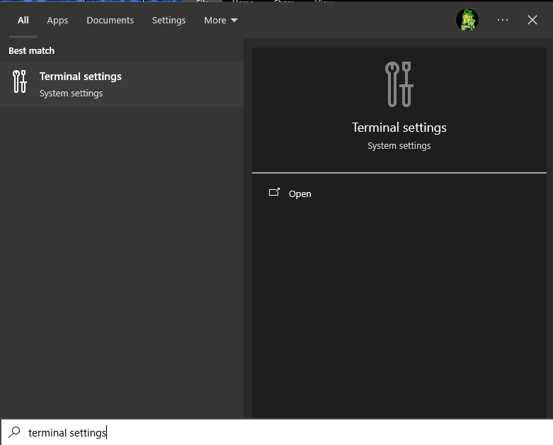
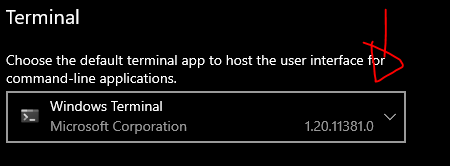
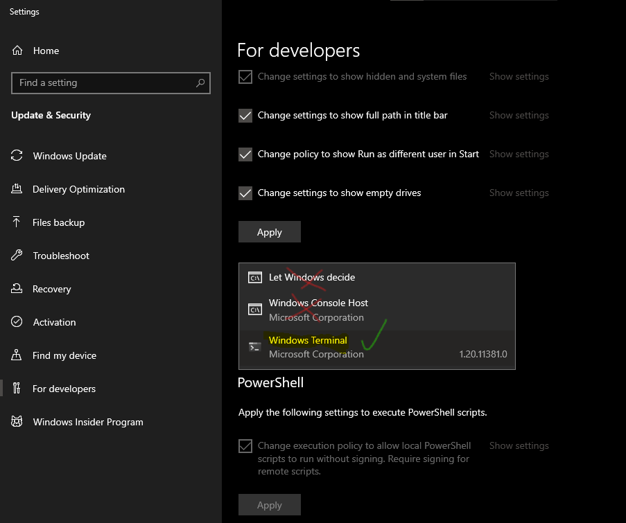
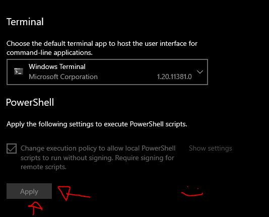

# How to install Windows Terminal

This isn't required, but plesae, JUST PLEASE use it! Reasons why:
* You can scroll up and down
* Customizable
* Made by microsoft : )
* Emojis allowed (idgaf but its cool)

## First, Install Windows Terminal
It's free and made by Microsoft, so no virus!
(Here's the official link)[https://www.microsoft.com/store/productId/9N0DX20HK701?ocid=pdpshare]

## Go to settings!
Step 1. Search "Terminal Settings"

Step 2. Click it and **scroll down**, and select "Default terminal"

Step 3. Select "Windows Termina"

Step 4. Apply changes
